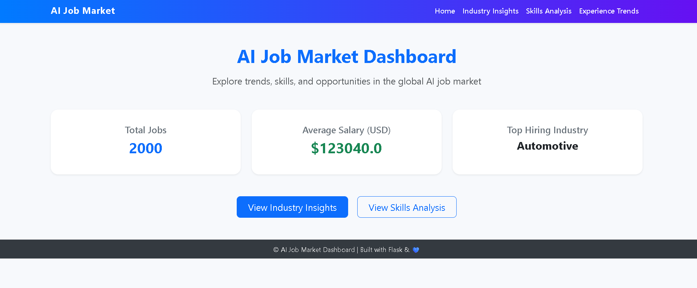

# AI Job Market Insights Dashboard

A simple Flask dashboard for visualizing AI job market data, including salary, industry, skills, and experience insights.

## Features
- Home page with summary stats
- Industry insights (top industries, highest paid)
- Skills analysis (most demanded skills)
- Experience insights (employment type, salary distribution)
- Interactive charts (matplotlib/seaborn)

## Setup
1. Clone this repo or download the code.
2. (Recommended) Create a virtual environment:
   ```powershell
   python -m venv venv
   .\venv\Scripts\activate
   ```
3. Install dependencies:
   ```powershell
   pip install -r requirements.txt
   ```
4. Run the app:
   ```powershell
   python main.py
   ```
5. Open your browser at `http://127.0.0.1:5000`

## File Structure
```
main.py
requirements.txt
data/
    ai_job_market.csv
templates/
    base.html
    home.html
    industry.html
    skills.html
    experience.html
```

## Data
- Place your AI job market CSV in the `data/` folder as `ai_job_market.csv`.

## Screenshots

! [Skills Analysis Insights](static/images/Skills.png)

## License
MIT
